

  

<h1 align="center">Pixel Minion</h1>

  <strong>AI-powered image and SVG generation inside VS Code</strong>

  Generate images and svgs ( vector graphics ) directly in your editor using cutting-edge AI models like Flux, Nano Banana, Chat GPT, and more via OpenRouter.

  
  
  
  

---

  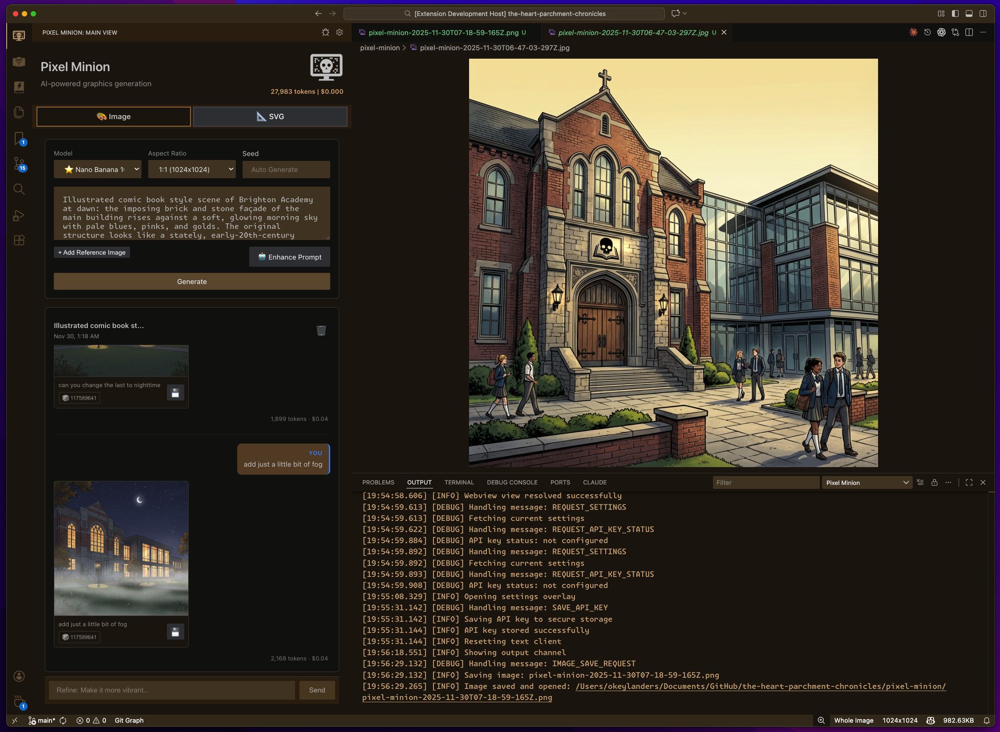

  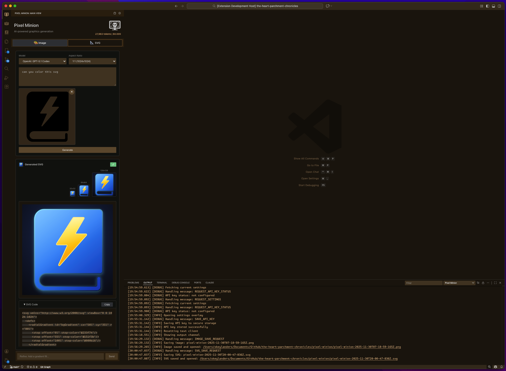

---

## 🎉 What's New in v1.2.0

> **🆕 New Image Models** - FLUX.2 Klein 4B, Riverflow V2 Pro, Riverflow V2 Fast
>
> **🆕 New SVG Models** - Claude Opus 4.6, GPT-5.2 Codex (now the default)
>
> **📋 Full Changelog** - See [CHANGELOG.md](CHANGELOG.md) for complete release notes.

---

<strong>📸 Screenshot Gallery</strong> (click to expand)

  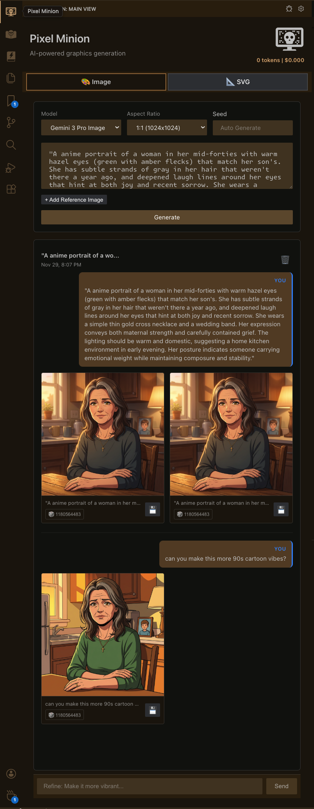

  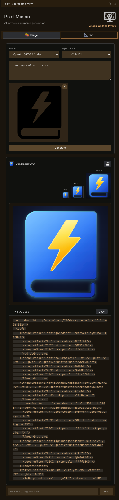

---

## ✨ Features at a Glance

Pixel Minion provides two powerful generation tabs in a dedicated sidebar panel:

- 🖼️ [**Image Generation**](#image-generation) - Text-to-image and image-to-image generation with [seed control](#image-seeds) and prompt enhance.
- ✏️ [**SVG Generation**](#svg-generation) - Create vector graphics with [multi-size preview](#svg-preview-sizes) and [code extraction](#svg-easy-code-extract)
- 🎨 [**AI SVG Edits**](#svg-colorize) - [Colorize](#svg-colorize), simplify, [animate](#svg-animate), or remove elements from existing SVGs
- 💬 [**Multi-Turn Conversations**](#image-multiturn) - Refine your images and SVGs through iterative prompts
- 📊 [**Token Usage Tracking**](#settings-token-usage) - Real-time token and cost display per turn
- 🔗 [**Reference Image Support**](#image-generation) - Use existing images and SVGs as context for generation
- ⚙️ [**Settings**](#settings) - [Model selection](#settings-model-override), API key management, and [debugging](#settings-debugging)

> **Tip:** For best experience, **widen your sidebar** to give Pixel Minion room to display all its features comfortably.

---

## 🚀 Getting Started

### Installation

1. Install from the [VS Code Marketplace](https://marketplace.visualstudio.com/)
2. Open the Pixel Minion panel from the activity bar (icon in sidebar)
3. Configure your OpenRouter API key in Settings (gear icon)
4. Start generating!

### Quick Start

1. **Choose a tab** - Image or SVG generation
2. **Enter a prompt** - Describe what you want to create
3. **Select options** - Model, aspect ratio, seed (optional)
4. **Generate** - Click the Generate button
5. **Refine** - Use the chat input to iterate on results

**Accessing Settings:**

Click the **gear icon** in the Pixel Minion panel header to open settings.

---

## 🔑 OpenRouter API Key

**Required:** All features require an OpenRouter API key.

### Setting Up OpenRouter

1. **Get an API Key**:
   - Visit [openrouter.ai](https://openrouter.ai/)
   - Create a pay-as-you-go account
   - Generate an API key

2. **Add Your Key**:
   - Click the **gear icon** in Pixel Minion's panel header
   - Paste your key in the "OpenRouter API Key" field
   - Your key is securely stored in your OS keychain
   - Changes save automatically

  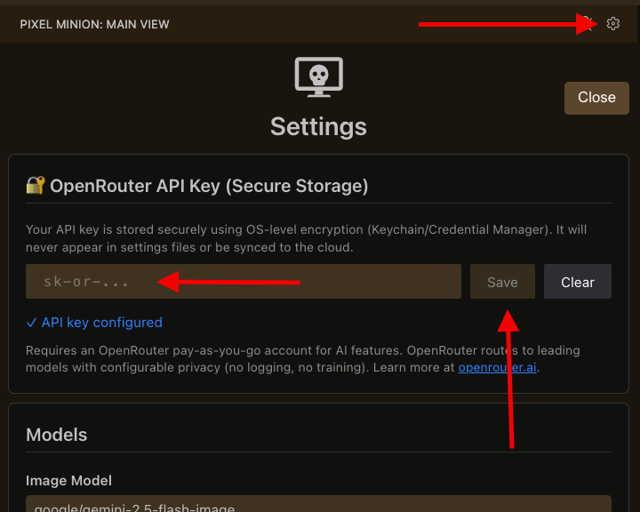

---

## 🛠️ Tools Overview

### 🖼️ Image Generation

Generate images from text prompts or refine existing images with AI.

  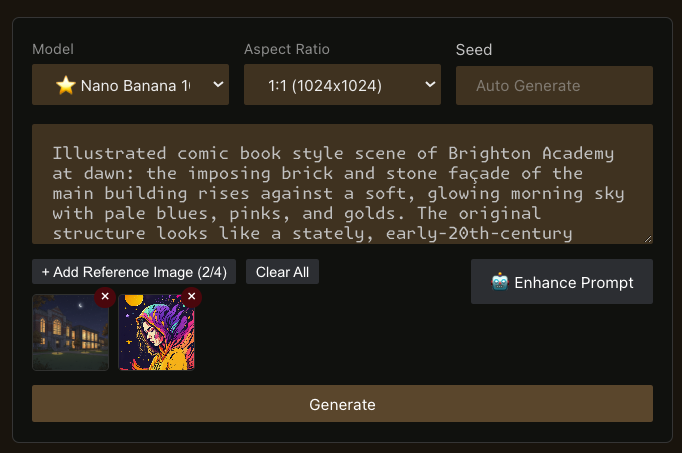

**Key Features:**

- **Text-to-Image** - Describe what you want, get an image
- **Image-to-Image** - Upload reference images for context
- **SVG Context** - Attach SVG files in Image-to-Image
- **Multi-Turn Conversations** - Refine results through iterative prompts
- **Aspect Ratio Control** - Choose from 1:1, 16:9, 9:16, 4:3, 3:4
- **Seed Control** - Set a seed for reproducible results
- **Enhance Prompt** - AI-powered prompt enhancement button
- **Token Usage** - See tokens and cost per generation

**Available Models:**

| Model | Description |
|-------|-------------|
| **Nano Banana 10/25** | Recommended - Gemini 2.5 Flash Image |
| **Nano Banana 8/25** | Gemini 2.5 Flash Image Preview |
| **Nano Banana Pro** | Gemini 3 Pro Image Preview |
| **GPT-5 Image Mini** | OpenAI's efficient image model |
| **GPT-5 Image** | OpenAI's premium image model |
| **FLUX.2 Pro/Flex** | Black Forest Labs models |

**Best Practices:**

- Start with a clear, descriptive prompt
- Use reference images for style guidance
- Iterate with the chat input for refinements
- Try different seeds for variety

  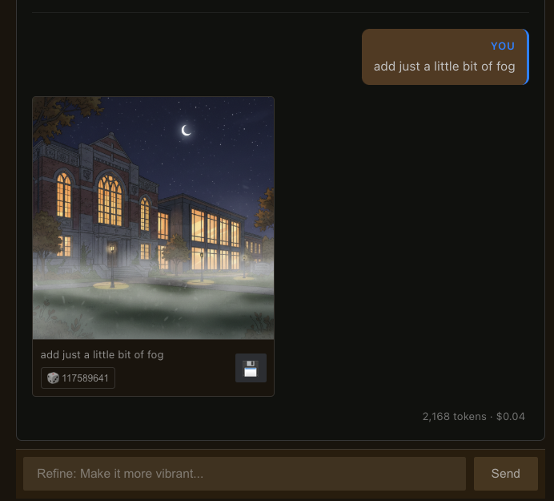

<em>Refine your images through multi-turn conversations</em>

  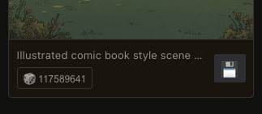

<em>Copy Randomly Generated Seed to Clipboard | Click To Save Image To Open Project</em>

---

### ✏️ SVG Generation

Generate vector graphics as code using powerful text models.

  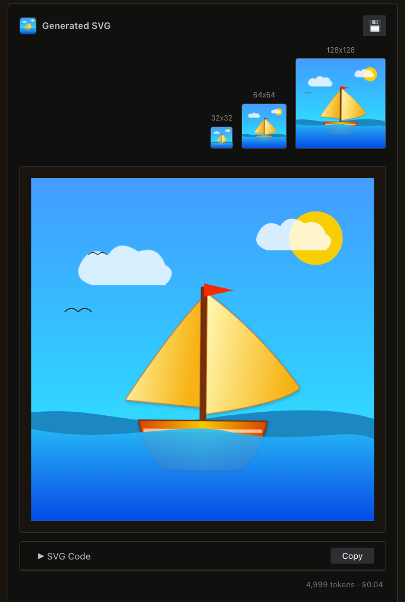

**Key Features:**

- **Text-to-SVG** - Describe the vector graphic you want
- **SVG-to-SVG** - Make AI Edits to Existing SVGs: Colorize, Simplify, Animate, Remove Elements, etc.
- **Reference Image** - Upload an image for the AI to vectorize or reference. ( this is not perfect - ha )
- **Multi-Size Preview** - See your SVG at 32px, 64px, and 128px
- **Code View** - View and copy the raw SVG code
- **Multi-Turn Conversations** - Refine your SVG through iteration
- **Token Usage** - See tokens and cost per generation
- **Easy Debug View** - Click "Bug" in top right corner to launch output and view errors or console messages.

**Available Models:**

| Model | Description |
|-------|-------------|
| **GPT-5.1 Codex** | Default - OpenAI's code-optimized model / **Recommended** |
| **Gemini Pro 3.0** | Google's latest text model / *Runner up* |
| **Claude Opus 4.5** | Anthropic's frontier model / Ok |

**Best Practices:**

- Be specific about colors, shapes, and style
- Do not attach large SVGs; SVGs with embedded images don't work.
- Reference standard SVG elements if you know them
- Use the preview sizes to check scalability
- Copy the code for use in your projects

> [!WARNING]
> ⚠️ **Not all SVGs are created equal!**
>
> Some SVGs are "fake" — they wrap bitmaps or embedded images that text models will attempt to extract and interpret. Results vary on these. Multi-turn conversations help refine the output.
>
> *Fun fact: I created, animated, and colored the Pixel Minion icon entirely in this tool!* ✨

  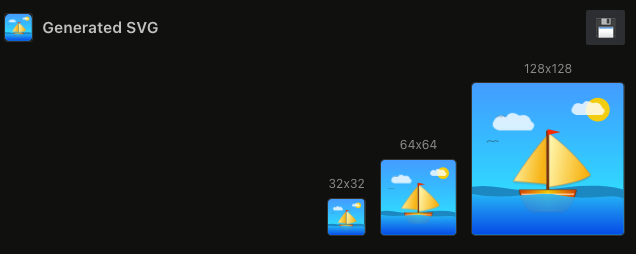

<em>Preview your SVG at 32px, 64px, and 128px to verify scalability</em>

  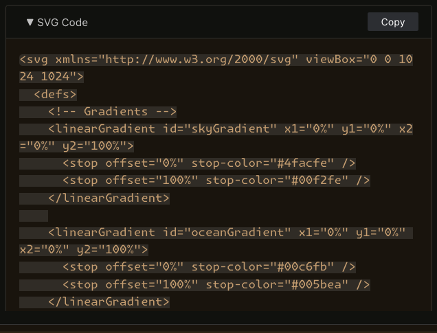

<em>Easily Review/Copy Code From Generated SVG </em>

  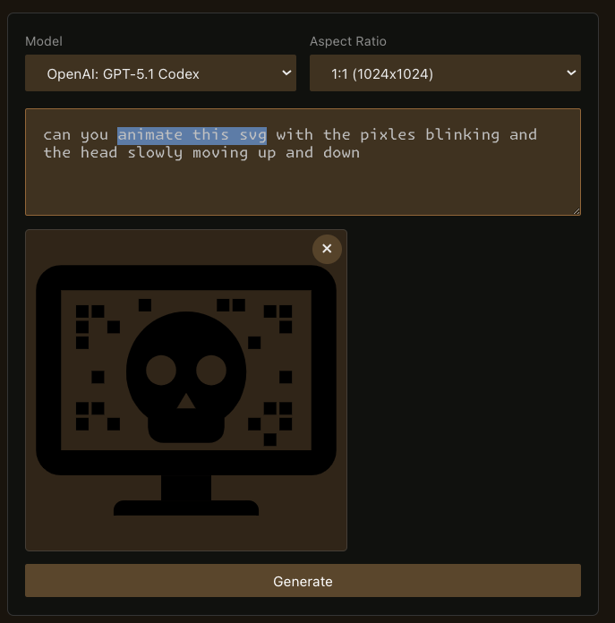

<em>Animate SVGs</em>

  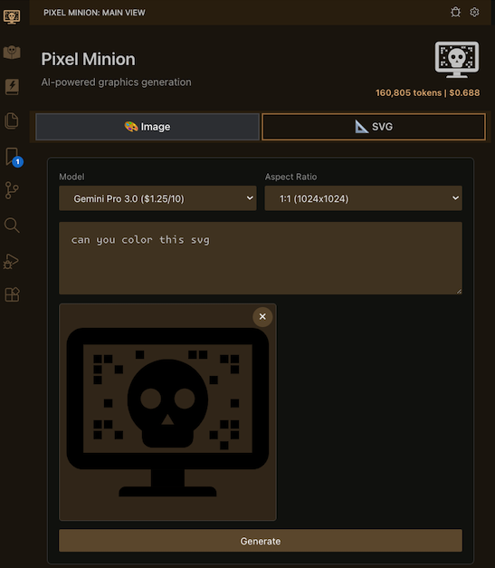
  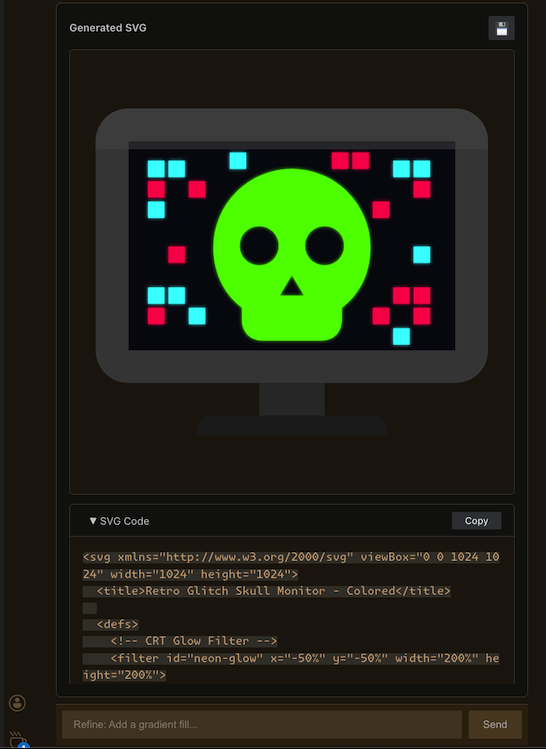

<em>Edit / Colorize SVGs</em>

---

## ⚙️ Settings

Click the **gear icon** in the Pixel Minion header for settings:

  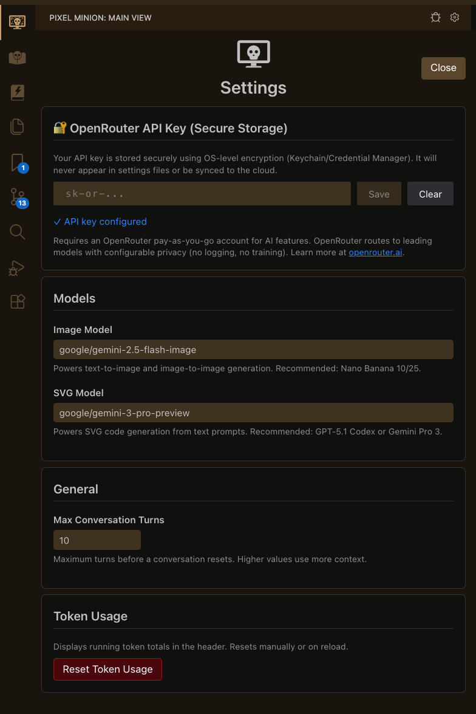

### General Settings

- **OpenRouter API Key** - Securely stored in OS keychain

### Model Selection

- **Image Model** - Model for image generation (recommended: Nano Banana 10/25)
- **SVG Model** - Model for SVG generation (recommended: GPT-5.1 Codex)

All settings save automatically and sync with your VS Code preferences.

  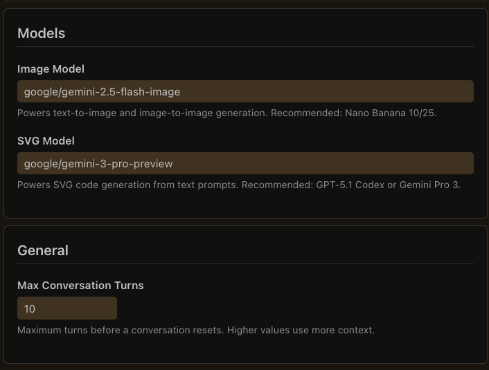

<em>Manually Override Model IDs from Dropdowns</em>

  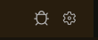

<em>View Debug Window by Clicking the Bug</em>

  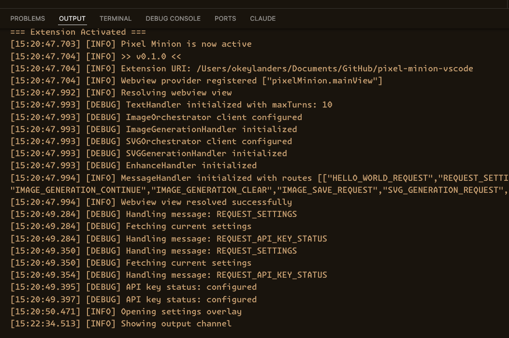

<em>Clear Output Logging</em>

  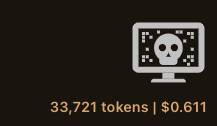

<em>Keep Track of Tokens & Cost</em>

  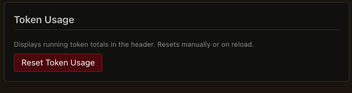

<em>Reset Token Usage In Settings</em>

---

## 🎯 Use Cases

### For Game Developers

- Generate sprites
- Create icons at multiple sizes
- Prototype visual concepts quickly

### For Web Developers

- Generate SVG icons and illustrations
- Create placeholder images
- Prototype UI graphics

### For Designers

- Quickly iterate on visual concepts
- Generate reference images
- Create scalable vector graphics

### For Content Creators

- Generate images for articles and posts
- Create custom illustrations
- Prototype visual ideas

---

## 📖 Technical Details

### Architecture

Built with **Clean Architecture** principles:

- Separation of concerns across layers
- Message-based communication
- Extensible provider system

### Privacy & Security

- **Secure API Key Storage** - Keys stored in OS keychain (Keychain Access, Credential Manager, libsecret) via VS Code SecretStorage
- **No Logging** - Extension communicates directly with OpenRouter and does not log to any other parties.
- **No Training** - Configure OpenRouter models to opt-out of training data

### Requirements

- VS Code 1.93.0 or higher
- OpenRouter API account

---

## 💡 Tips & Best Practices

### Sidebar Width

- **Widen your sidebar** - Pixel Minion has rich UI elements; give it room to breathe
- Drag the sidebar edge to ~400-600px for optimal layout

### Prompting Tips

- Be descriptive and specific
- Mention style, colors, composition
- Use reference images for better results
- Iterate with refinement prompts

### Cost Management

- Use the token display to track costs
- Choose efficient models for prototyping
- Use premium models for final outputs

---

## 🤝 Contributing

We welcome contributions! See the codebase for:

- Clean Architecture with TypeScript
- React-based webview UI
- Jest testing framework
- ESLint for code quality

---

## 📄 License

**AGPL-3.0 with Commons Clause** - Source-available, no resale, no closed-source derivatives.

This means:
- Free to use for personal and open-source projects
- Full source code available
- Modify and share under the same terms
- Cannot resell or create proprietary derivatives

See [LICENSE](LICENSE) for complete terms.

---

## ☕ Support Development

If Pixel Minion helps your workflow, consider [buying me a coffee](https://buymeacoffee.com/okeylanders)!

---

## 🙏 Acknowledgments

Built with:
- [OpenRouter](https://openrouter.ai/) - AI model routing
- [VS Code Extension API](https://code.visualstudio.com/api) - Platform
- [React](https://react.dev/) - UI framework

Development assisted by:
- [Claude Code](https://www.anthropic.com/claude) - AI pair programming
- [Cline](https://github.com/cline/cline) - AI coding assistant for VS Code

---

## 🎨 Part of the Minion Suite

**Pixel Minion** is part of the **Minion Suite** of VS Code extensions:

| Extension | Description |
|-----------|-------------|
| **[Prose Minion](https://marketplace.visualstudio.com/items?itemName=OkeyLanders.prose-minion)** | AI-powered writing assistant for VS Code - grammar, style, and prose enhancement |
| **Pixel Minion** | AI-powered image and SVG generation (you are here!) |

More minions coming soon...

---

  <strong>Happy Creating!</strong>

  <a href="https://marketplace.visualstudio.com/items?itemName=OkeyLanders.pixel-minion">Install from Marketplace</a> •
  <a href="https://github.com/okeylanders/pixel-minion-vscode/issues">Report Issue</a> •
  <a href="https://buymeacoffee.com/okeylanders">Support Development</a>

